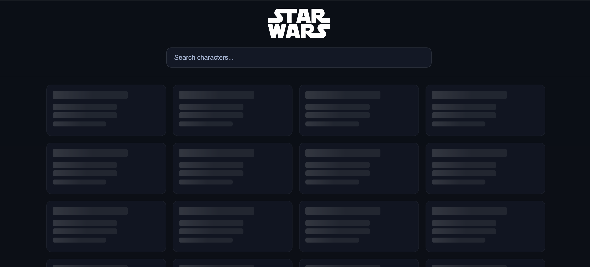

# Star Wars Characters Browser

A modern Star Wars character browser built with Vanilla JavaScript and Lit web components, featuring progressive loading, real-time search, and a sleek dark theme.

## Features

- **Real-time Search** - Instant character search with live filtering
- **Progressive Loading** - Fast initial load (10 characters) + background loading of remaining data
- **Modern Dark UI** - Sleek dark theme with smooth animations and hover effects
- **Responsive Design** - Grid layout that adapts to different screen sizes
- **Web Components** - Built with Lit for reusable, encapsulated components
- **Skeleton Loading** - Animated loading states for better UX
- **Character Profiles** - Modal popups with detailed character information
- **Error Handling** - Graceful error states with user-friendly messages

## Quick Start

```bash
npm install
npm run start
```

Then open http://127.0.0.1:5173 in your browser.

## Application States

The app handles different states gracefully:

### Loading State
- Skeleton cards with shimmer animation during data fetch
- Progressive loading: shows first 10 characters immediately, loads rest in background

### No Data State
- Clean empty state when no characters match search criteria

### Error State  
- User-friendly error handling when SWAPI is unavailable

## Architecture

- **API**: [`https://swapi.dev/`](https://swapi.dev/) - Star Wars API
- **Framework**: Lit 3.3.1 for web components
- **Routing**: Simple hash-based router for SPA navigation
- **Styling**: CSS custom properties for theming

## Quick start (details)

The `start` script runs a simple static server on port 5173.

### Development Commands

- `npm run start` - Start the development server
- `npm run format` - Format all code with Prettier
- `npm run format:check` - Check if code is properly formatted

## Components

### Core Components
- **`home-page`** - Main application view with search and character grid
- **`character-card`** - Individual character display with hover effects
- **`character-profile`** - Modal popup with detailed character information
- **`character-list`** - Alternative list view (currently unused)

### Loading States
- **`skeleton-card`** - Animated loading placeholder for character cards
- **`skeleton-profile`** - Loading placeholder for character profile modal

## Project Structure

```
/ (root)
  index.html                    # Entry HTML with CSS variables and import map
  assets/
    icons/
      sw-logo.png              # Star Wars logo (white, 70px height)
      no-data.png              # No data state icon
      server-down.png          # Server error icon
      avatar-1.png             # Character avatar 1
      avatar-2.png             # Character avatar 2
      character-avatar.svg     # Default character avatar
  src/
    main.js                    # Hash-based router and component imports
    services/
      api.js                   # SWAPI API calls (getFirstPage, getAllPeople, getPerson)
    components/
      home-page.js             # Main app component with search and grid
      character-card.js        # Character card with click handler
      character-list.js        # Character list component
      character-profile.js     # Modal popup for character details
      loading-states/
        skeleton-card.js       # Loading skeleton for cards
        skeleton-profile.js    # Loading skeleton for profile
```

## Code Formatting

This project uses [Prettier](https://prettier.io/) for consistent code formatting.

- **Configuration**: `.prettierrc` and `.prettierignore`
- **Format code**: `npm run format`
- **Check formatting**: `npm run format:check`

## Technical Details

### Progressive Loading Strategy
1. **Phase 1**: Load first page (10 characters) for immediate display
2. **Phase 2**: Background load remaining characters if no search is active
3. **Search**: Only loads first page results for instant feedback

### API Integration
- **Base URL**: `https://swapi.dev/api`
- **Endpoints**: `/people/` with pagination and search support
- **Error Handling**: Graceful fallbacks with user-friendly messages

### Styling
- **CSS Variables**: Centralized theming with `--bg`, `--panel`, `--text`, `--muted`, `--accent`
- **Responsive Grid**: `repeat(auto-fill, minmax(280px, 1fr))` for character cards
- **Animations**: Smooth transitions and hover effects throughout

### Mock Methods (for Demo)
- `loadCharactersNoDataMock()` - Demonstrates empty state
- `loadCharactersServerErrorMock()` - Demonstrates error state

## Dependencies

- **Lit**: 3.3.1 - Web components framework
- **http-server**: 14.1.1 - Development server
- **Prettier**: ^3.6.2 - Code formatting

## Data Source

All character data courtesy of [SWAPI - The Star Wars API](https://swapi.dev/).

## Screenshots

### Main Application

*Character grid with search functionality and character details*

### Loading State

*Skeleton cards with shimmer animation during initial data fetch*

### No Data State

*Clean empty state when no characters match search criteria*

### Error State

*User-friendly error handling when SWAPI is unavailable*
